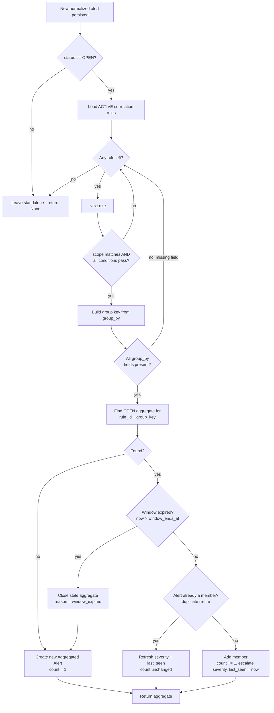
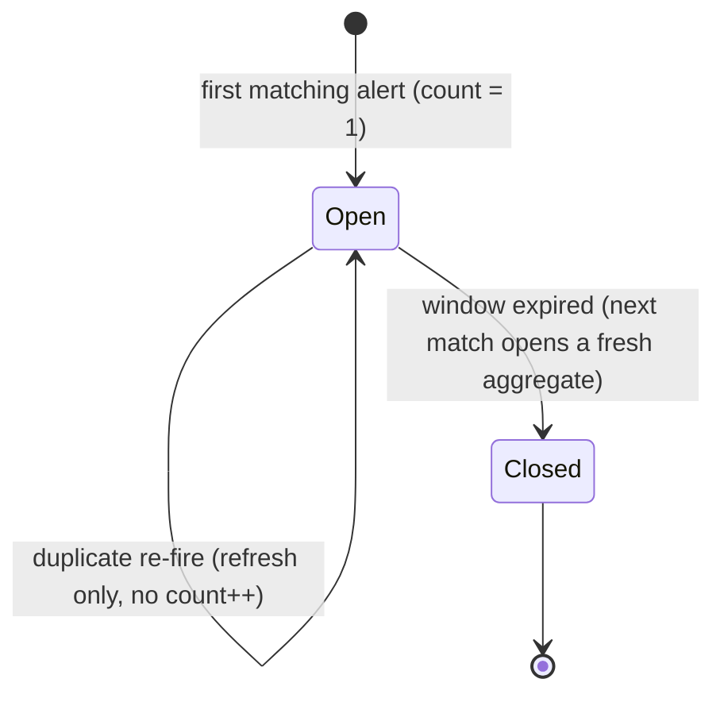
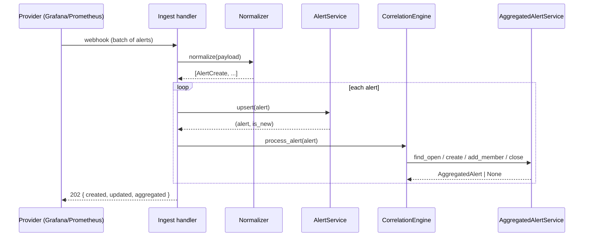

# Alert Correlation & Aggregation

High-level design of the logic that decides, for every incoming alert, whether
it stays a **standalone alert** or gets folded into an **Aggregated Alert**.

- **Code:** [`app/services/correlation_engine.py`](../app/services/correlation_engine.py) (decision logic)
  · [`app/services/aggregated_alert.py`](../app/services/aggregated_alert.py) (persistence)
- **Model:** [`app/models/aggregated_alert.py`](../app/models/aggregated_alert.py)
- **Entry point:** [`app/api/v1/ingest.py`](../app/api/v1/ingest.py) → `_persist_and_correlate`
- **Read API:** `GET /api/v1/aggregated-alerts`

---

## 1. Why

A single real-world problem (a bad deploy, a node going down) often makes dozens
of alerts fire across services within seconds. Surfacing each one separately
buries the signal in noise. **Correlation rules** describe *which* alerts belong
together and *how* to group them; the **correlation engine** applies those rules
in real time as alerts are ingested, collapsing related alerts into one
Aggregated Alert that carries a running `count`, the highest `severity` seen,
and a `last_seen` timestamp.

> This is distinct from the **manual** aggregation in `AlertService.aggregate`,
> where a user hand-picks alerts in the feed. That path collapses alerts into a
> summary `Alert` row flagged with `extra_fields._is_aggregated`. The engine
> described here is **automatic** and writes to the dedicated
> `aggregated_alerts` table.

---

## 2. Key concepts

| Concept | What it is |
| --- | --- |
| **Alert** | A single normalized alert (`app/models/alert.py`). Fields may be promoted columns (`application`, `region`, `severity`, …) or raw provider labels under `extra_fields.labels` (`service`, `host`, `environment`, …). |
| **Correlation Rule** | User-defined rule (`app/models/correlation_rule.py`) with a `scope`, a list of `conditions`, a `time_window_minutes`, and a `group_by` list. |
| **Aggregated Alert** | A container (`app/models/aggregated_alert.py`) grouping alerts that matched the same rule and share the same `group_by` values within the time window. |

### Correlation Rule shape

```jsonc
{
  "name": "Payments service degradation",
  "enabled": true,
  "scope": { "application": "payments" },          // pre-filter (equality, AND). Empty = all alerts
  "conditions": [                                    // ALL must pass (logical AND)
    { "field": "severity", "operator": "equals",      "value": "Critical" },
    { "field": "service",  "operator": "is_present" }
  ],
  "group_by": ["service", "host"],                  // alerts grouped by these field values
  "time_window_minutes": 5                          // how long an aggregate stays open
}
```

---

## 3. The flow

For each alert (already normalized and persisted by the ingest handler), the
engine walks the **active** rules in order and stops at the **first** rule that
matches (first-match-wins). If no rule matches, the alert is left standalone.



### Field resolution (`resolve_field`)

A rule can reference a field by name without knowing where it lives. Lookup
order:

1. promoted top-level column — `alert.<field>` (enums like `severity` are
   unwrapped to their string value, e.g. `"Critical"`);
2. `extra_fields[field]`;
3. `extra_fields["labels"][field]` — Prometheus/Grafana labels;
4. `extra_fields["annotations"][field]`.

Absent everywhere → `None`.

### Operators (`evaluate_condition`)

| Operator | Semantics |
| --- | --- |
| `equals` / `not_equals` | string comparison of the resolved value |
| `contains` | substring test |
| `greater_than` / `less_than` / `greater_or_equal` / `less_or_equal` | numeric comparison (non-numeric operands → fail) |
| `is_present` | field resolved to a non-`None` value |

A **missing field fails every operator except `is_present`**. Unknown operators
fail closed (they never accidentally match).

### Grouping (`compute_group`)

The group key is a deterministic string built from the rule's `group_by`
values, e.g. `group_by=["service","host"]` →
`"service=payments|host=web-01"`. **If any `group_by` field is missing on the
alert, the alert cannot be grouped by that rule and the rule is skipped.**

### Severity merge (`merge_severity`)

An aggregate only ever **escalates**: `Critical > Error > Warning > Info`. A
lower-severity member never lowers the aggregate's severity.

---

## 4. Aggregated Alert lifecycle



The window is a **tumbling window per group**: `window_ends_at` is snapshotted
at creation as `first_seen + time_window_minutes` and never slides. Once it
elapses, the aggregate is closed (`close_reason = "window_expired"`) and the
next matching alert opens a brand-new aggregate.

---

## 5. Edge cases (explicitly handled)

| Edge case | Handling |
| --- | --- |
| **Duplicate alert** (same alert re-fires; `upsert` returns the same row) | The alert id is already in `alert_ids` → `severity`/`last_seen` refresh, but `count` is **not** incremented. |
| **Missing group-by field** | `compute_group` returns `None`; the rule is skipped (logged), other rules still evaluated. |
| **Expired time window** | Stale open aggregate is closed with `reason="window_expired"`; a fresh aggregate is opened for the new alert. |
| **Resolved / dismissed alert** | Only `OPEN` alerts are correlated; a provider-resolved alert never opens or grows an aggregate. |
| **Alert matches several rules** | First matching active rule wins; the alert lands in exactly one aggregate. |
| **A rule throws mid-ingest** | Correlation is best-effort in the ingest handler: the error is logged, the transaction rolled back, and the (already-persisted) alert is left standalone — the webhook still succeeds. |

---

## 6. Where it plugs in



---

## 7. Design notes

- **Pure decision core.** All decision logic (`resolve_field`, `rule_matches`,
  `compute_group`, `merge_severity`, `is_window_expired`, `build_aggregate`,
  `apply_member`) consists of module-level pure functions that take plain model
  instances and touch no database. This makes every branch and edge case
  unit-testable without a live DB (see `tests/test_correlation_engine.py`).
- **Thin persistence.** `AggregatedAlertService` only runs queries and flushes
  the mutations the pure helpers produce. `CorrelationEngine` orchestrates the
  two; its service dependencies are injected (real singletons in production,
  in-memory fakes in tests).
- **Deduplication is the source of truth on `alert_ids`.** Because ingest
  upserts alerts by `(source_id, external_id)`, a re-fire keeps the same alert
  id, which is how the engine recognises a duplicate and avoids double-counting.
